- [Game description](#game-description)
  - [Controls](#controls)
  - [Screenshots](#screenshots)
- [Algorithms](#algorithms)
  - [REINFORCE](#reinforce)
  - [SARSA](#sarsa)
  - [DQN](#dqn)
    - [Improvements to DQN:](#improvements-to-dqn)
      - [Prioritized experience replay (PER)](#prioritized-experience-replay-per)
      - [Double DQN](#double-dqn)
  - [A2C](#a2c)
    - [Advantage function estimations:](#advantage-function-estimations)
      - [n-step Returns](#n-step-returns)
      - [Generalized Advantage Estimation (GAE)](#generalized-advantage-estimation-gae)
  - [Proximal Policy Optimization (PPO)](#proximal-policy-optimization-ppo)
- [Experimental results](#experimental-results)
  - [REINFORCE:](#reinforce-1)
    - [Results:](#results)
  - [SARSA](#sarsa-1)
    - [Results:](#results-1)
  - [Vanilla DQN](#vanilla-dqn)
    - [Results:](#results-2)
  - [DQN with PER](#dqn-with-per)
    - [Results:](#results-3)
  - [Double DQN with PER](#double-dqn-with-per)
    - [Results:](#results-4)
  - [A2C n-step](#a2c-n-step)
    - [Results:](#results-5)
  - [A2C GAE](#a2c-gae)
    - [Results:](#results-6)
  - [PPO](#ppo)
    - [Results:](#results-7)
- [Conclusions](#conclusions)

<div style="page-break-after: always;"></div>  

# Game description
**Wizard of Wor** was released in 1980 by Midway. Up to two players fight in a series of monster-infested mazes, clearing each maze by shooting the creatures.  
Each dungeon consists of a single-screen rectangular grid with walls and corridors in various formations ([wikipedia](https://en.wikipedia.org/wiki/Wizard_of_Wor))
## Controls
As described in [strategywiki.org](https://strategywiki.org/wiki/Wizard_of_Wor/How_to_play), an agent can:
 - move in the 4 directions (UP, DOWN, LEFT, RIGHT);
 - face the 4 directions (UP, DOWN, LEFT, RIGHT);
 - Shoot  

<div style="page-break-after: always;"></div>  

## Screenshots  
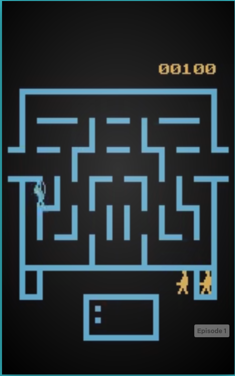  
<div style="page-break-after: always;"></div>  

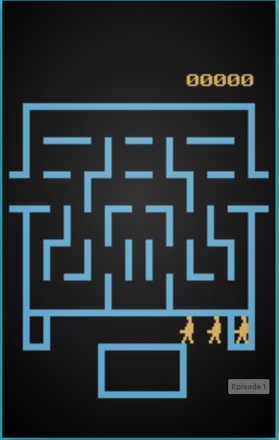  
<div style="page-break-after: always;"></div>  

# Algorithms  
The following algorithms were experimented with: 
## REINFORCE
The agent tries to maximize the return by acting in the environment, given a state. The algorithms samples a trajectory, which is composed of (state, action, reward received by the environment) tuple. The rewards received are used to calculate an discounted sum which represents the score of the agent. 
The objective of the algorithm is to maximize this score using gradient ascent algorithm.  
REINFORCE is a policy based algorithm.
## SARSA  
SARSA -- State-Action-Reward-State-Action -- is a value-based algorithm that tries to find the optimal Q-value (a measure of the overall expected reward assuming the Agent is in a state s and performs action a and continues to follow a policy until the end of the episode). A SARSA agent interacts with the environment and updates the Q-value estimation based on the action taken in current state, s<sub>t</sub> and the next action taken in s<sub>t+1</sub>. The next action, a<sub>t+1</sub> to be taken is determined under the current policy.
## DQN 
Like SARSA, DQN -- Deep Q-Networks -- is also a value-based algorithm that approximates the Q-function. The difference to SARSA algorithm is the fact that DQN tries to learn the optimal Q-function, instead of the Q-function of the current policy. DQN is an off-policy algorithm that uses the concept of *experience replay memory*. 
Experience replay memory is a buffer that stores the *k* most recent experience an agent has gathered. This experience is then batched and used in estimating the optimal Q-function. 
### Improvements to DQN: 
#### Prioritized experience replay (PER)
The experiences stored in the replay memory are not all the same. Some memories are more useful to the agent learning than others. This idea is the main contributor to the Prioritized experience replay. Instead of sampling uniformly, some experiences have a higher probability to be selected due to the fact that the agent can learn more from those. The prioritization is done based on the difference between the agent's expectations when taking an action and what actually happened in the next step.  
#### Double DQN
The double DQN algorithm introduces a new network, so it can learn two Q-function estimates using different experiences. The first network is used to select the next state a' and the second network is used to calculate the Q-value for (s', a') - target network.  
## A2C
A2C -- Advantage Actor-Critic -- is an algorithm that consists of two components:
 - an *actor* which learns a policy
 - a *critic* which learns the value function to evaluate state-action pairs. It is common to learn the *advantage* function (A(s,a) = Q(s, a) - V(s)), denoting how much better an action is compared to the others.
The advantage function generated by the critic is used by the actor in learning the policy, in contrast to REINFORCE algorithm, which relay on the reward received by the environment. The reason behind this approach is the transformation of a sparse reward space (for example, in a state s, the reward for all actions is 0. How should the agent choose?) into a dense one. 
### Advantage function estimations:
#### n-step Returns
In order to calculate the advantage function, an estimation for Q and V functions is needed. In order to estimate both of these functions, it is preferred to learn the V function and then use this function in order to estimate the Q value. The Q function can be interpreted as a mix of the expected rewards for *n* time steps, followed by V(s<sub>n+1</sub>). In order to make this tractable to estimate, a single trajectory of rewards is used instead of the expectation.
#### Generalized Advantage Estimation (GAE)
The previous approximation use a "hard" hyper-parameter, *n*, representing the number of steps of actual rewards. The idea of GAE is to replace this **one** value of *n* with a mix of multiple values of *n* -- calculate the advantage function using a weighted average of individual advantages calculated for different *n* values. The weight is controlled by the hyper-parameter lambda.  
## Proximal Policy Optimization (PPO)
PPO algorithms modify the original objective of the environment with the *surrogate objective* such that the improvement is monotonic (no sudden performance collapses). The main idea behind this family of algorithms is that it should be better to keep the previous policy if the updated one does not add any improvement (or even decrees the performance). The clipped PPO algorithm, additionally, adds a constraint such that the policy does not have large and risky changes in an update, that could jeopardize the training  

<div style="page-break-after: always;"></div>  

# Experimental results  
Only one config file was used, in which all the configurations were written.
The config file and the results can be found on the following [github repository](https://github.com/cVladu/RL_project)

## REINFORCE: 
```json 
  "Reinforce": {
    "agent": [{
      "name": "Reinforce",
      "algorithm": {
        "name": "Reinforce",
        "action_pdtype": "default",
        "action_policy": "epsilon_greedy",
        "center_return": true,
        "explore_var_spec": {
          "name": "linear_decay",
          "start_value": 1.0,
          "end_val": 0.01,
          "start_step": 0,
          "end_step": 50000
        },
        "gamma": 0.9,
        "entropy_coef_spec": {
          "name": "linear_decay",
          "start_val": 0.01,
          "end_val": 0.001,
          "start_step": 0,
          "end_step": 20000
        },
        "training_frequency": 32
      },
      "memory": {
        "name": "OnPolicyBatchReplay"
      },
```  
<div style="page-break-after: always;"></div>  

``` json
      "net": {
        "type": "ConvNet",
        "shared": true,
        "conv_hid_layers": [
          [32, 8, 4, 0, 1],
          [64, 4, 2, 0, 1],
          [32, 3, 1, 0, 1]
        ],
        "fc_hid_layers": [512],
        "hid_layers_activation": "relu", 
        "out_layer_activation": "tanh",
        "init_fn": null,
        "normalize": true,
        "batch_norm": false,
        "clip_grad_val": 0.5,
        "loss_spec":{
          "name": "MSELoss"
        },
        "optim_spec":{
          "name": "Adam",
          "lr": 1e-4
        },
        "lr_scheduler_spec": null,
        "update_type": "replace",
        "update_frequency": 1000,
        "gpu": true
      }
    }],
    "env": [{
      "name": "WizardOfWor-v0",
      "max_t": null,
      "max_frame": 1e6,
      "frame_op": "concat",
      "frame_op_len": 4,
      "reward_scale": "sign",
      "num_envs": 8
    }],
    "body": {
      "product": "outer",
      "num": 1
    },
    "meta": {
      "distributed": false,
      "eval_frequency": 5000,
      "max_session": 4,
      "max_trial": 1
    }
  }
``` 
**Algorithm**: The algorithm is REINFORCE. Gamma is set to 0.9 and a baseline is used by enabling `center_return`. The exploration technique used is epsilon-greedy, starting at 1 (random actions) and ending to 0.01 (mainly learned policy actions).  
**Memory**: The memory is `OnPolicyBatchReplay` as REINFORCE is an on policy algorithm  
**Network architecture**: The network architecture is a convolutional neural network architecture. The network was taken from [slm_lab/spec/benchmark/dqn/ddqn_per_atari.json](https://github.com/kengz/SLM-Lab/blob/master/slm_lab/spec/benchmark/dqn/ddqn_per_atari.json). The same network was used for all the experiments. In the following subchapters, the network will be omitted, except for the situations where it is slightly modified.  
**Optimizer**: The optimizer is Adam with a learning rate of 0.0001. Like the Network architecture, the optimizer is kept constant for all the experiments and will not be shown if no modification are done.  
**Environment**: The environment used is the *WizardOfWor*, which encodes the state as the whole frame. 4 consecutive frames are stacked and passed to the neural network.  
**Training length**: All the agents were trained for 1M time steps.  
**Evaluation**: The evaluation is done every 5000 steps for all the agents.  

### Results:  
Trial graph                                                    | Trial graph with moving average
:-------------------------------------------------------------:|:----------------------------------------------------------------:
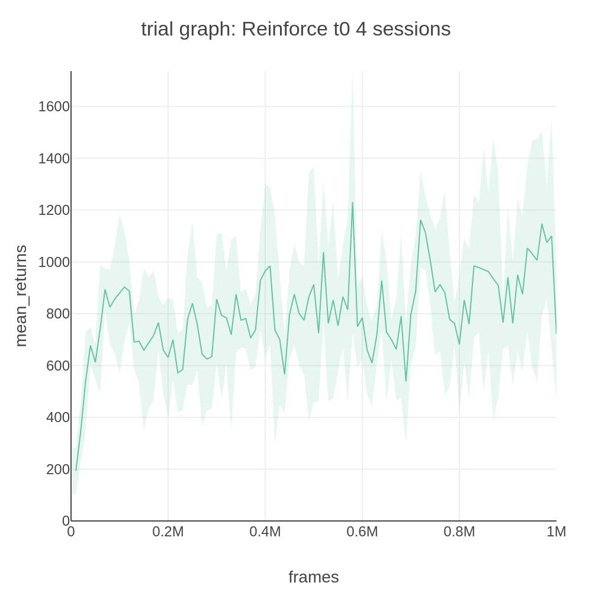|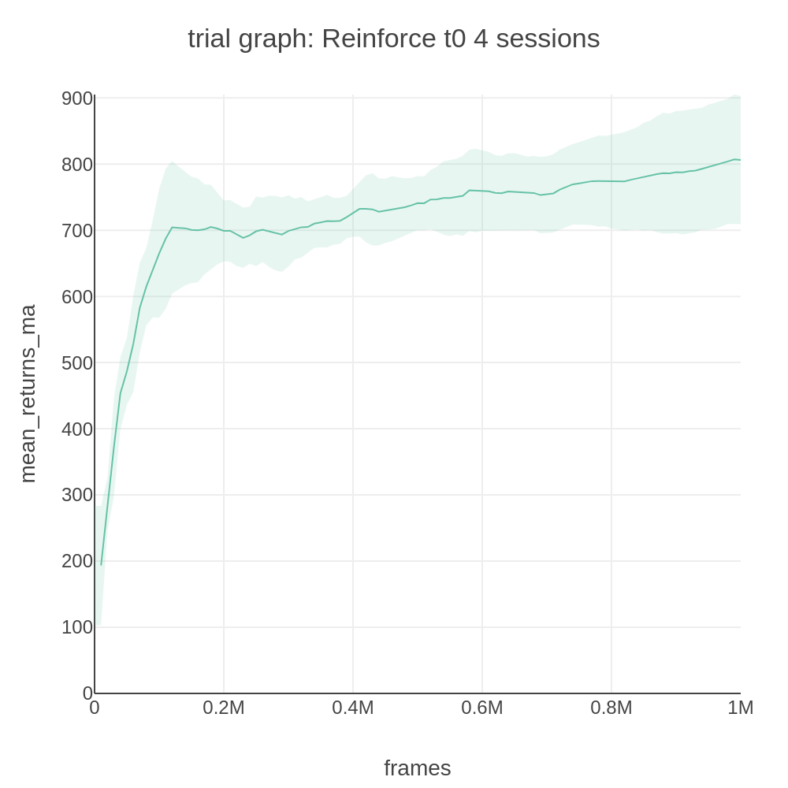

<div style="page-break-after: always;"></div>  

## SARSA
``` json
  "SARSA_boltzmann": {
    "agent": [{
      "name": "Sarsa",
      "algorithm": {
        "name": "SARSA",
        "action_pdtype": "Argmax",
        "action_policy": "boltzmann",
        "center_return": true,
        "explore_var_spec": {
          "name": "linear_decay",
          "start_value": 5.0,
          "end_val": 1,
          "start_step": 0,
          "end_step": 50000
        },
        "gamma": 0.9,
        "entropy_coef_spec": {
          "name": "linear_decay",
          "start_val": 0.01,
          "end_val": 0.001,
          "start_step": 0,
          "end_step": 20000
        },
        "training_frequency": 32
      },
      "memory": {
        "name": "OnPolicyBatchReplay"
      },
      "net": ...,
    }],
    "env": ...,
    "body": ...,
    "meta": ...
  }
```
**Algorithm**: The algorithm is SARSA. The exploration technique used is the Boltzmann policy. Instead of randomly taking an action, the Boltzmann policy constructs a probability distribution over the Q-values for all actions *a* by applying the softmax function, parametrized by a temperature tau. This temperature controls the how uniform or concentrated the distribution results are: 
 - high values of tau push the distribution to be more uniform (closer to the epsilon greedy)
 - low values of tau push the distribution to be more concentrated (closer to the Q values estimated)
I start with the tau to 5.0, which makes the distribution more uniform, resulting in the agent exploring the environment. I linearly reduce the tau to 1, which reduces the Boltzmann policy to the softmax function.  

**Memory**: The memory is `OnPolicyBatchReplay` as SARSA is an on policy algorithm  
**Network architecture**: The same.  
**Optimizer**: The same.  
**Environment**: The same.  
**Training length**: The same.  
**Evaluation**: The same.  

### Results:  
Trial graph                                                          | Trial graph with moving average
:-------------------------------------------------------------------:|:----------------------------------------------------------------------:
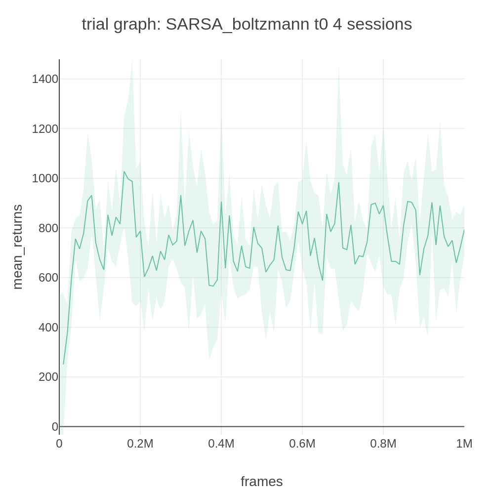|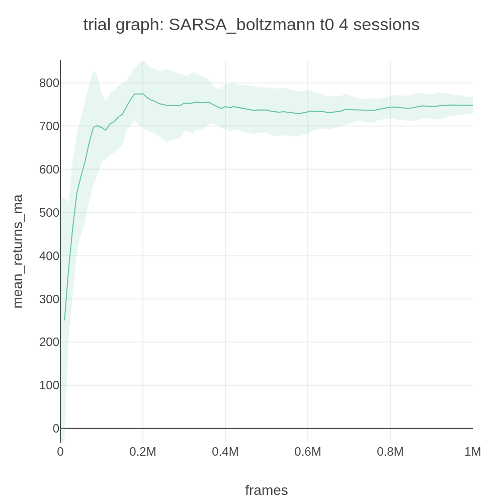

<div style="page-break-after: always;"></div>  

## Vanilla DQN  
``` json 
  "VanillaDQN": {
    "agent": [{
      "name": "VanillaDQN",
      "algorithm": {
        "name": "VanillaDQN",
        "action_pdtype": "Categorical",
        "action_policy": "epsilon_greedy",
        "center_return": true,
        "explore_var_spec": {
          "name": "linear_decay",
          "start_value": 1.0,
          "end_val": 0.01,
          "start_step": 10000,
          "end_step": 1000000
        },
        "gamma": 0.99,
        "training_frequency": 32,
        "training_iter": 4,
        "training_batch_iter": 1,
        "training_start_step": 10000
      },
      "memory": {
        "name": "Replay",
        "batch_size": 32,
        "max_size": 10000,
        "use_cer": false
      },
      "net": ...,
    }],
    "env": ...,
    "body": ...,
    "meta": ...
  },
```  
**Algorithm**: The algorithm is DQN with no improvements. The exploration technique used epsilon-greedy, as described in REINFORCE configuration.  
**Memory**: The memory is `Replay` as DQN uses the experience replay buffer, as described in previous [chapter](#dqn). It uses a batch of 32 experiences and can store a maximum of 10000 experiences. The agent explores and stores experiences without training, denoted by `training_start_step` parameter. The agent uses 4 batches from the memory replay buffer and makes 1 update to the network parameters every 32 steps.  
**Network architecture**: The same.  
**Optimizer**: The same.  
**Environment**: The same.  
**Training length**: The same.  
**Evaluation**: The same.  

### Results:  
Trial graph                                                     | Trial graph with moving average
:--------------------------------------------------------------:|:-----------------------------------------------------------------:
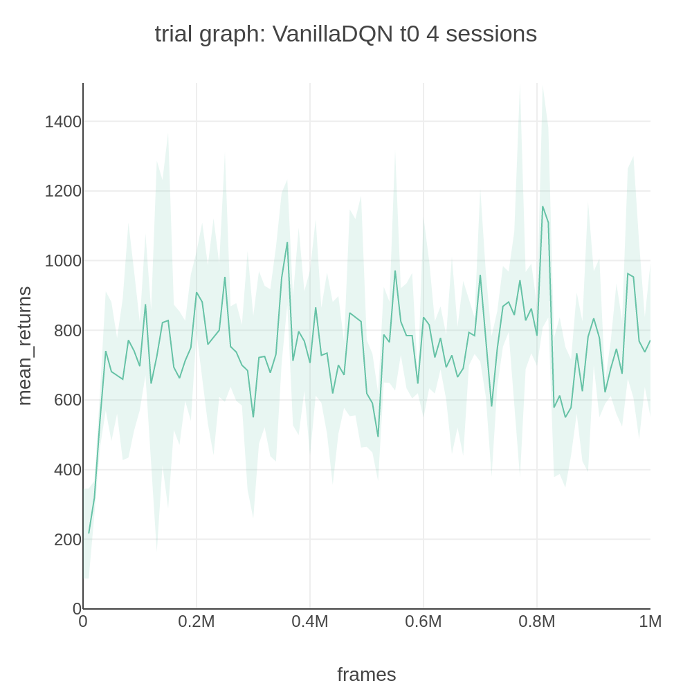|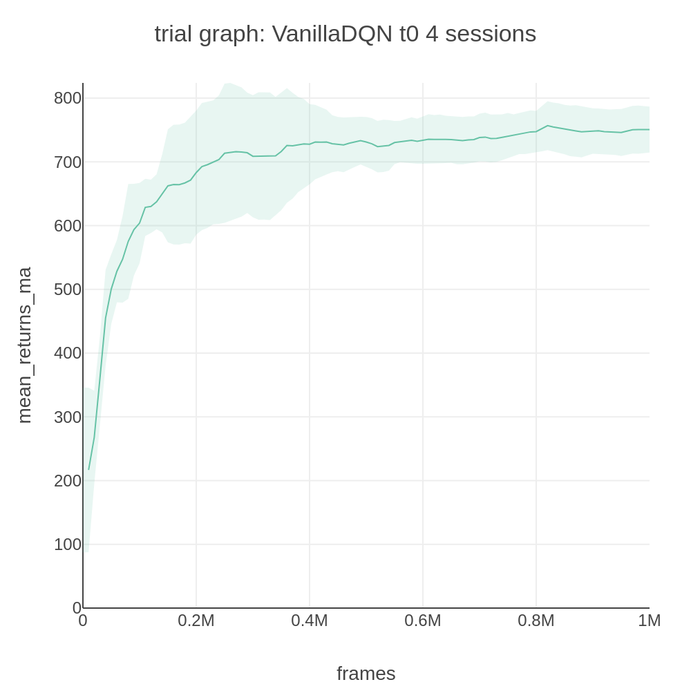

<div style="page-break-after: always;"></div>  

## DQN with PER
``` json
  "DQN_PrioritizedReplay": {
    "agent": [{
      "name": "DQN",
      "algorithm": {
        "name": "DQN",
        "action_pdtype": "Categorical",
        "action_policy": "epsilon_greedy",
        "center_return": true,
        "explore_var_spec": {
          "name": "linear_decay",
          "start_value": 1.0,
          "end_val": 0.01,
          "start_step": 10000,
          "end_step": 1000000
        },
        "gamma": 0.99,
        "training_frequency": 32,
        "training_iter": 4,
        "training_batch_iter": 1,
        "training_start_step": 10000
      },
      "memory": {
        "name": "PrioritizedReplay",
        "batch_size": 32,
        "max_size": 10000,
        "use_cer": false,
        "epsilon": 1e4,
        "alpha": 0.6
      },
      "net": ...,
    }],
    "env": ...,
    "body": ...,
    "meta": ...,`
  }
```  
**Algorithm**: The algorithm is DQN.  
**Memory**: The memory is `PrioritizedReplay`. Alpha is set to 0.6. Alpha represents the probability coefficient included in the priority of experiences. An alpha value of 1 corresponds to uniform sampling (the same as `Replay`). All the other hyper parameters are kept like the previous DQN configuration.  
**Network architecture**: The same.  
**Optimizer**: The same.  
**Environment**: The same.  
**Training length**: The same.  
**Evaluation**: The same.   

### Results:  
Trial graph                                                                | Trial graph with moving average
:-------------------------------------------------------------------------:|:----------------------------------------------------------------------------:
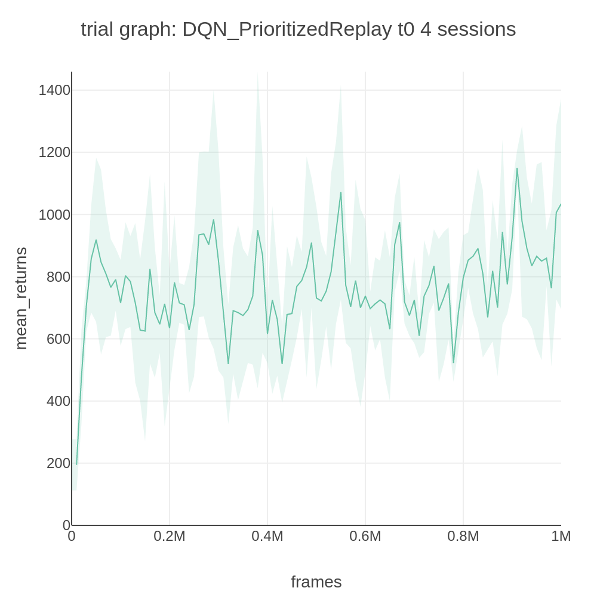|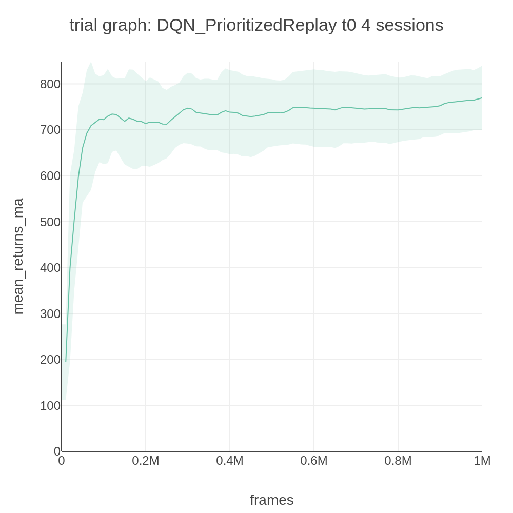

<div style="page-break-after: always;"></div>  

## Double DQN with PER  
``` json
  "DDQN_PrioritizedReplay": {
    "agent": [{
      "name": "DDQN",
      "algorithm": {
        "name": "DoubleDQN",
....
```
The configuration is identical to [DQN with PER](#dqn-with-per), except for the `algorithm name`, which is DoubleDQN.  

### Results:  
Trial graph                                                                 | Trial graph with moving average
:--------------------------------------------------------------------------:|:-----------------------------------------------------------------------------:
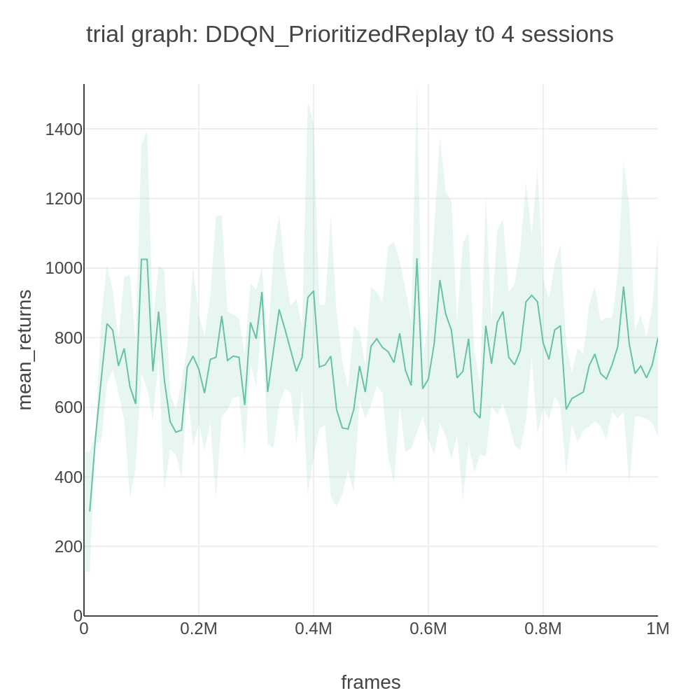|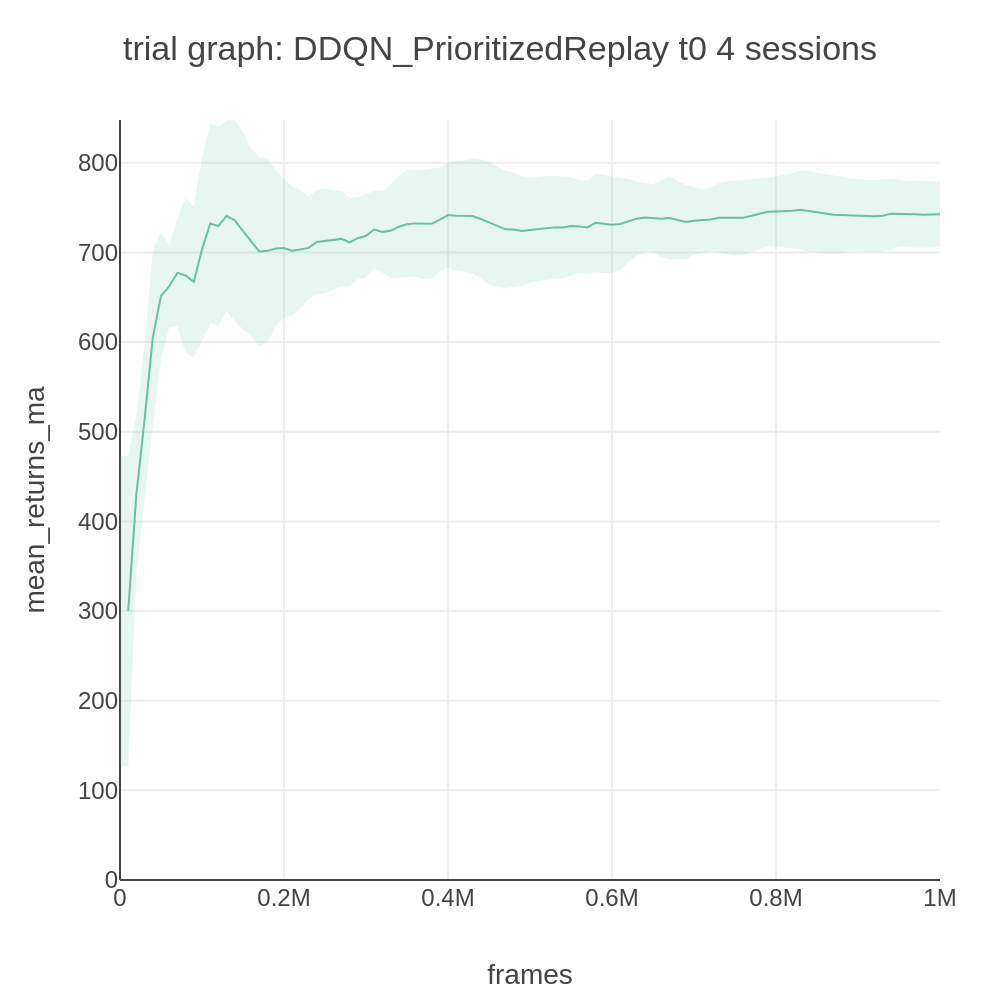

<div style="page-break-after: always;"></div>  

## A2C n-step
``` json
"A2C_nstep": {
    "agent": [{
      "name": "A2C_nstep",
      "algorithm": {
        "name": "ActorCritic",
        "action_pdtype": "Categorical",
        "action_policy": "default",
        "center_return": true,
        "gamma": 0.99,
        "lam": null,
        "num_step_returns": 0.99,
        "entropy_coef_spec": {
          "name": "no_decay",
          "start_val": 0.01,
          "end_val": 0.01,
          "start_step": 0,
          "end_step": 0
        },
        "val_loss_coef": 0.5,
        "training_frequency": 5
      },
      "memory": {
        "name": "OnPolicyBatchReplay"
      },
      "net": {
        "type": "ConvNet",
        "shared": true,
        "conv_hid_layers": [
          [32, 8, 4, 0, 1],
          [64, 4, 2, 0, 1],
          [32, 3, 1, 0, 1]
        ],
        "fc_hid_layers": [512],
        "hid_layers_activation": "relu", 
        "init_fn": "orthogonal_",
        "normalize": true,
        "batch_norm": false,
        "clip_grad_val": 0.5,
        "use_same_optim": false,
        "loss_spec":{
          "name": "MSELoss"
        },
        "actor_optim_spec":{
          "name": "Adam",
          "lr": 1e-4
        },
        "critic_optim_spec":{
          "name": "Adam",
          "lr": 1e-4
        },
        "lr_scheduler_spec": null,
        "gpu": true
      }
    }],
    "env": [{
      "name": "WizardOfWor-v0",
      "max_t": null,
      "max_frame": 1e6,
      "frame_op": "concat",
      "frame_op_len": 4,
      "reward_scale": "sign",
      "num_envs": 8
    }],
    "body": ...,
    "meta": ...,
  },
```
**Algorithm**: The algorithm is Actor-Critic. As `lam` is not specified (set to null) and `num_step_returns` is specified, [n-step](#n-step-returns) algorithm is used.   
**Memory**: The memory is `PrioritizedReplay`. Alpha is set to 0.6. Alpha represents the probability coefficient included in the priority of experiences. An alpha value of 1 corresponds to uniform sampling (the same as `Replay`). All the other hyper parameters are kept like the previous DQN configuration.
**Network architecture**: The actor and critic used a shared network. The init function for the network is `orthogonal_`, taken from [RL_Slides_6.pdf](https://drive.google.com/file/d/11se3PGKZezbpOjvdsD5QUfmq6VNzR6sv/edit)   
**Optimizer**: The same.   
**Training frequency**: The training is batch-wise and the batch size is 5 x 8 (`training_frequency` = 5, `num_envs` = 8)  
**Environment**: The same.  
**Training length**: The same.  
**Evaluation**: The same. 

<div style="page-break-after: always;"></div>  

### Results:  
Trial graph                                                    | Trial graph with moving average
:-------------------------------------------------------------:|:----------------------------------------------------------------:
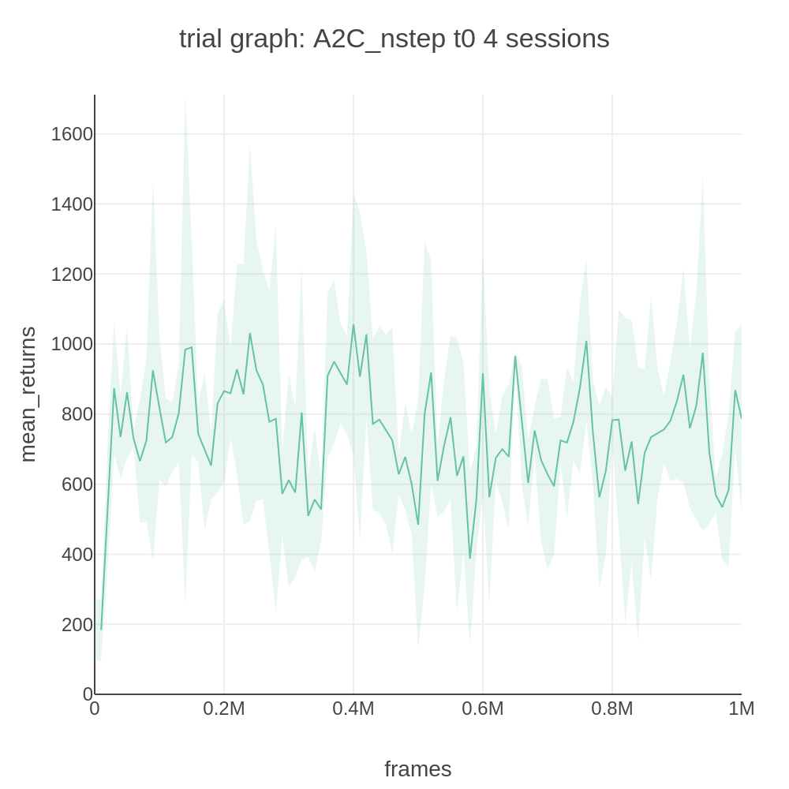|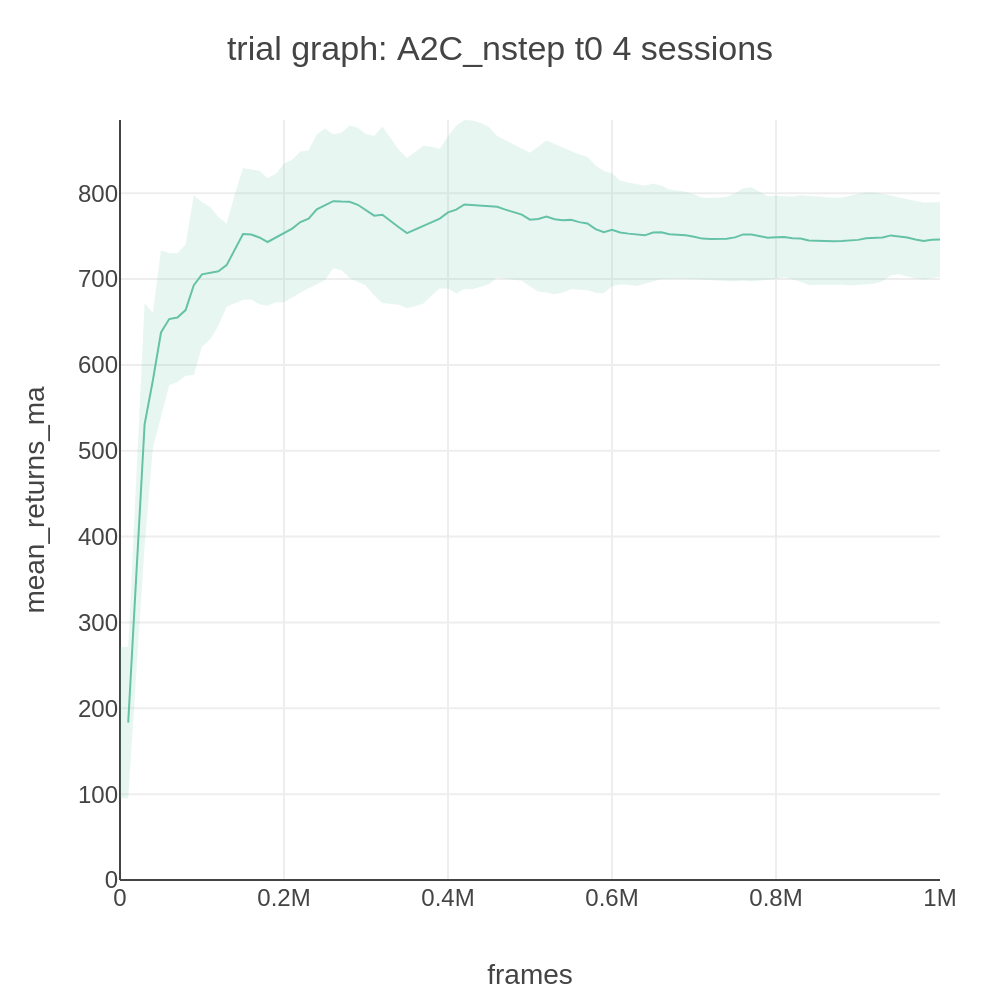

<div style="page-break-after: always;"></div>  

## A2C GAE
``` json
  "A2C_gae": {
    "agent": [{
      "name": "A2C_gae",
      "algorithm": {
        "name": "ActorCritic",
        "action_pdtype": "Categorical",
        "action_policy": "default",
        "center_return": true,
        "gamma": 0.99,
        "lam": 0.9,
        "num_step_returns": null,
...
```
**Algorithm**: The algorithm is Actor-Critic. As `lam` is specified and `num_step_returns` is not specified (set to null), [GAE](#generalized-advantage-estimation-gae) algorithm is used. 
**Memory**: The same as [A2C n-step](#a2c-n-step)  
**Network architecture**: The actor and critic used a shared network.  
**Optimizer**: The same.  
**Training frequency**: The training is batch-wise and the batch size is 5 x 8 (`training_frequency` = 5, `num_envs` = 8)  
**Environment**: The same.  
**Training length**: The same.  
**Evaluation**: The same.  

### Results:  
Trial graph                                                  | Trial graph with moving average
:-----------------------------------------------------------:|:--------------------------------------------------------------:
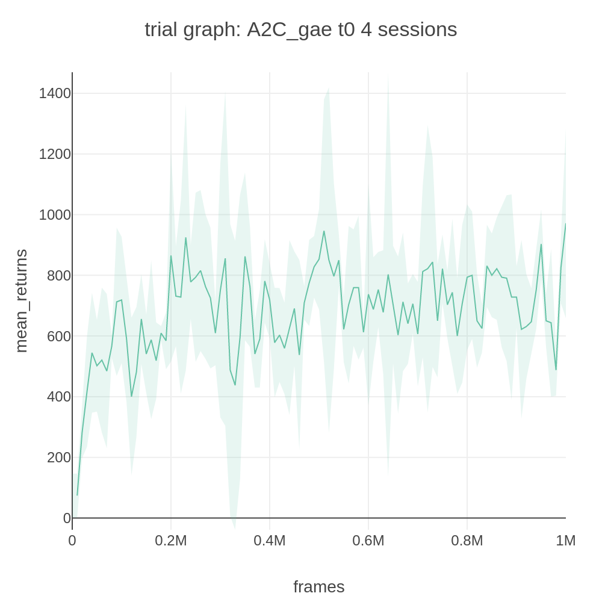|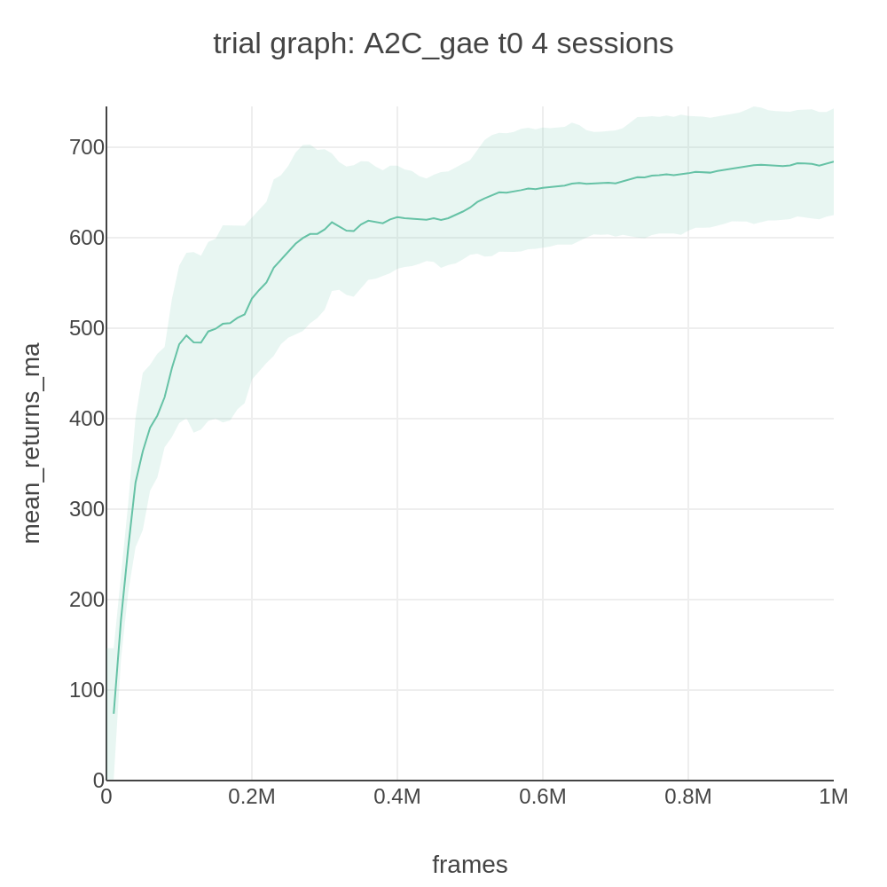

<div style="page-break-after: always;"></div>  

## PPO
``` json 
  "PPO": {
    "agent": [{
      "name": "PPO",
      "algorithm": {
        "name": "PPO",
        "action_pdtype": "Categorical",
        "action_policy": "default",
        "center_return": true,
        "gamma": 0.99,
        "lam": 0.95,
        "clip_eps_spec": {
          "name": "no_decay",
          "start_val": 0.10,
          "end_val": 0.10,
          "start_step": 0,
          "end_step": 0
        },
        "entropy_coef_spec": {
          "name": "no_decay",
          "start_val": 0.01,
          "end_val": 0.01,
          "start_step": 0,
          "end_step": 0
        },
        "val_loss_coef": 0.5,
        "time_horizon": 128,
        "minibatch_size": 128,
        "training_epoch": 4
      },
      "memory": {
        "name": "OnPolicyBatchReplay"
      },
      "net": ...,
    }],
    "env": {
      ...,
      "num_envs": 8
    }
    "body": ...,
    "meta": {
      ...,
      "max_session": 2,
      ...,
    }
  },
```
**Algorithm**: The algorithm is PPO with clipping, with epsilon = 0.10, in `clips_eps_spec`.  
**Memory**: `OnPolicyBatchReplay` as PPO is an on policy algorithm and required batching.  
**Network architecture**: The same as [A2C network](#a2c-n-step)  
**Optimizer**: The same.  
**Training frequency**: The number of epochs is 4, the minibatch size is 128 and time horizon is set to 128.  
**Environment**: The number of actors is 8.  
**Training length**: The same.  
**Evaluation**: The same.  

### Results:  
Trial graph                                              | Trial graph with moving average
:-------------------------------------------------------:|:----------------------------------------------------------:
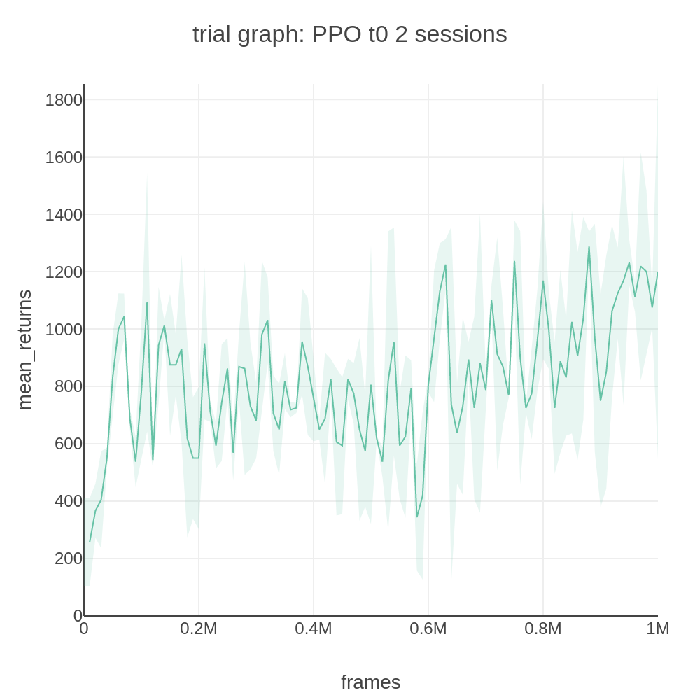|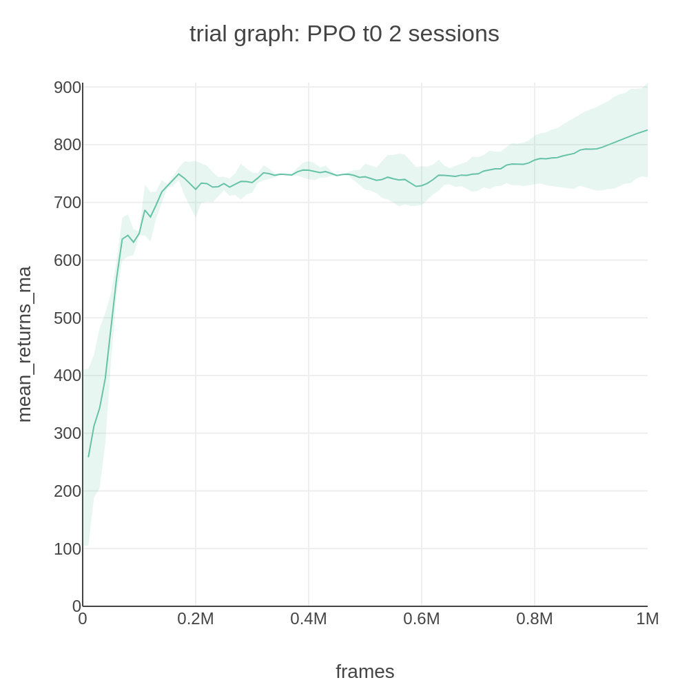

<div style="page-break-after: always;"></div>  

# Conclusions
The algorithms show similar results as the [SLM-Lab Atari Environment Benchmark](https://slm-lab.gitbook.io/slm-lab/benchmark-results/atari-benchmark) ([Picture](https://user-images.githubusercontent.com/8209263/67738200-dc862680-f9ca-11e9-8722-67a664dbbf10.png)) for the first 1M steps.  
The difference between the algorithms is not that noticeable. This might be due to the different hyper parameters that were not suitable for this particular environment. Another reason might be the number of steps for the algorithms, which is relatively low.  
The former hypothesis is backed-up by the SLM Lab benchmarks, which shows that all the algorithms tried by the authors have a convergence point to around 800 after 1M steps. To further test this hypothesis, PPO algorithm was run for 10M frames, with the same configuration, and the results can be observed below:  
Trial graph                                                  | Trial graph with moving average
:-----------------------------------------------------------:|:--------------------------------------------------------------:
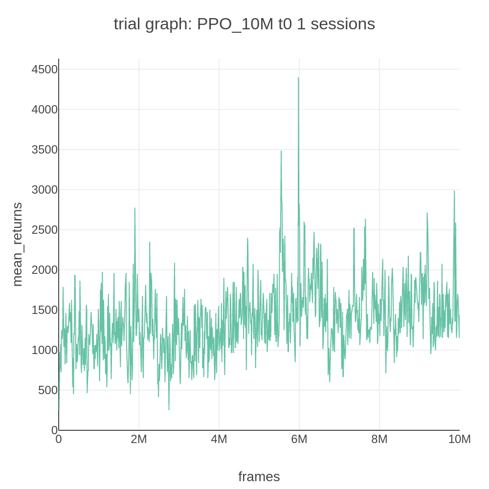|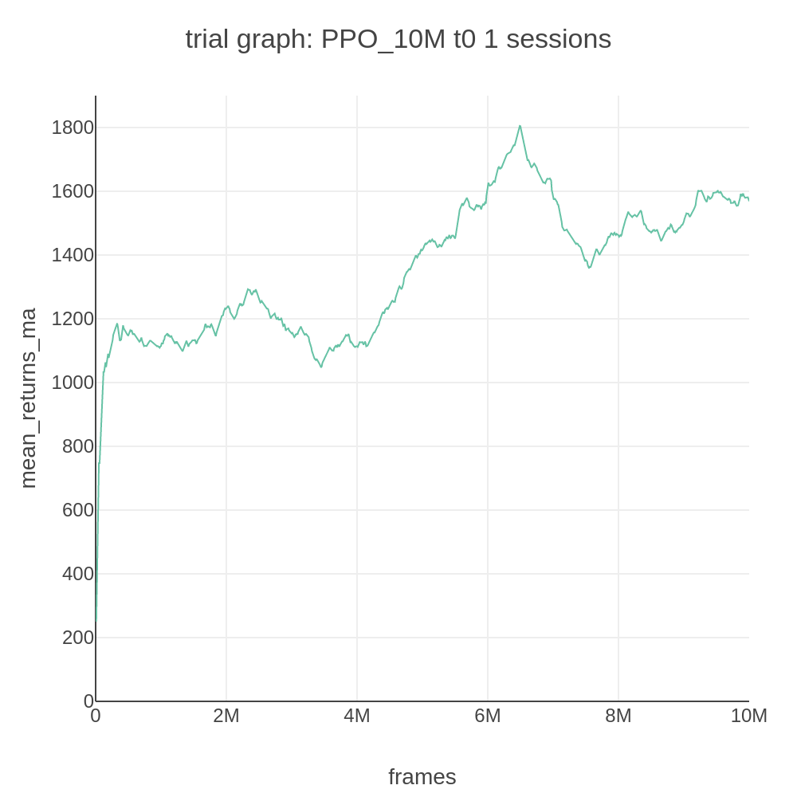
The agent does not reach the score of *4283* as in the benchmark, but the configurations are not similar (comparing with [slm_lab/spec/benchmark/ppo/ppo_atari.json](https://github.com/kengz/SLM-Lab/blob/master/slm_lab/spec/benchmark/ppo/ppo_atari.json)):
 - Different lam value 
 - Higher starting learning rate for the benchmark configuration
 - My configuration does not have any learning rate scheduling employed
 - The number of environments used in the benchmarking is doubled. 
   - *The number of environments was reduced due to hardware limitations and lack of access to [Colab](https://colab.research.google.com) GPU* 
 - Different hidden layer units